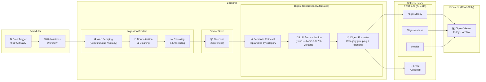

# AI News Pulse — Project Context

> **A RAG-powered daily digest system that scrapes leading AI publications every day at a fixed time and automatically delivers concise, source-backed summaries of the latest AI developments — no user query required.**

---

## Overview

AI News Pulse is a fully automated, push-based RAG system that scrapes top AI news websites, research blogs, and industry publications **every day at a fixed time (9:00 AM)**. It ingests, cleans, chunks, and embeds the scraped content into **Pinecone** (vector store) using **BGE** (`BAAI/bge-small-en-v1.5`), then uses **Groq** (`llama-3.3-70b-versatile`) to automatically generate a structured daily digest — a curated summary of the day's most important AI developments, grouped by category and backed by source citations. **No user query is needed.** The digest is stored in **PostgreSQL**, published to the frontend, and optionally delivered via email. The core constraint is **recency, factual accuracy, and zero-touch operation**.

---

## Objective

Design and implement a **RAG-based automated AI news digest system** that:

- [x] Scrapes and ingests articles from 10+ leading AI news sources daily at a fixed scheduled time
- [x] Normalizes, chunks, and embeds scraped content into Pinecone using BGE (`BAAI/bge-small-en-v1.5`)
- [x] Automatically retrieves the most relevant articles and generates a structured daily digest using Groq (`llama-3.3-70b-versatile`) — without any user query
- [x] Groups news into categories (e.g., LLM Releases, Research, Funding, Policy) with source citations
- [x] Publishes the digest to a frontend dashboard and optionally delivers it via email
- [x] Strictly avoids generating speculative opinions, predictions, or unverifiable claims

---

## Target Users

- **AI/ML Engineers & Researchers** — Professionals who need a quick daily digest of breakthroughs, model releases, and tooling updates without manually browsing dozens of sites
- **Tech Founders & Product Managers** — Decision-makers tracking the AI landscape for strategic planning, competitive analysis, and partnership opportunities
- **AI Enthusiasts & Students** — Learners who want a curated, jargon-aware feed of what's happening in the AI world, with links to dive deeper
- **Journalists & Content Creators** — Writers covering the tech beat who need rapid access to verified facts and source links for their reporting

---

## Scope of Work

### 1. Data / Corpus Definition

<!-- 
  Define the data sources the project will use.
  - What domain/entity is being covered?
  - How many items/records/documents?
  - What types of sources?
-->

- **Selected Domain / Entity:** AI & Machine Learning — news, research announcements, product launches, and industry analysis
- **Number of items:** Approximately 50–200 articles ingested per day across all sources (volume varies by news cycle)
- **Category coverage:** LLM Releases, Research Papers, AI Startups & Funding, AI Policy & Regulation, Open-Source Tools, Industry Applications

#### Selected Items

| # | Source Name | Category | Update Frequency | Content Type | Source URL |
|---|---|---|---|---|---|
| 1 | MIT Technology Review — AI | Research & Industry | Daily | Articles, Analysis | [Link](https://www.technologyreview.com/topic/artificial-intelligence/) |
| 2 | OpenAI Blog | LLM Releases | Weekly | Announcements, Research | [Link](https://openai.com/blog) |
| 3 | Google AI Blog | Research & Products | Weekly | Research, Product Updates | [Link](https://blog.google/technology/ai/) |
| 4 | DeepMind Blog | Research | Bi-weekly | Research Papers, Announcements | [Link](https://deepmind.google/discover/blog/) |
| 5 | Hugging Face Blog | Open-Source Tools | Weekly | Tutorials, Releases | [Link](https://huggingface.co/blog) |
| 6 | The Verge — AI | Industry News | Daily | News, Analysis | [Link](https://www.theverge.com/ai-artificial-intelligence) |
| 7 | TechCrunch — AI | Startups & Funding | Daily | News, Funding Rounds | [Link](https://techcrunch.com/category/artificial-intelligence/) |
| 8 | Ars Technica — AI | Industry & Research | Daily | In-depth Articles | [Link](https://arstechnica.com/ai/) |
| 9 | VentureBeat — AI | Enterprise AI | Daily | Industry Analysis | [Link](https://venturebeat.com/category/ai/) |
| 10 | arXiv — cs.AI (via RSS) | Academic Research | Daily | Paper Abstracts | [Link](https://arxiv.org/list/cs.AI/recent) |

#### Source URLs

| # | Source Type | URL |
|---|---|---|
| 1 | AI News & Analysis | https://www.technologyreview.com/topic/artificial-intelligence/ |
| 2 | LLM Provider Blog | https://openai.com/blog |
| 3 | LLM Provider Blog | https://blog.google/technology/ai/ |
| 4 | Research Lab Blog | https://deepmind.google/discover/blog/ |
| 5 | Open-Source Community | https://huggingface.co/blog |
| 6 | General Tech — AI Beat | https://www.theverge.com/ai-artificial-intelligence |
| 7 | Startup & Funding News | https://techcrunch.com/category/artificial-intelligence/ |
| 8 | In-depth Tech Reporting | https://arstechnica.com/ai/ |
| 9 | Enterprise AI News | https://venturebeat.com/category/ai/ |
| 10 | Academic Preprints (RSS) | https://arxiv.org/list/cs.AI/recent |
| 11 | AI Policy & Regulation | https://www.whitehouse.gov/ostp/ai/ |
| 12 | AI Safety Research | https://www.anthropic.com/research |

> **Note:** Source list is as of 19 Jul 2026. New sources can be added via configuration. Scraping frequency and article volume will be calibrated during the first week of operation.

---

### 2. Core Feature Requirements

The system operates on a **fully automated push model** — no user queries are involved. Each day, the pipeline produces a structured digest.

#### Daily Digest Structure

The auto-generated digest must contain the following **sections** (each populated only if relevant news exists):

| Digest Section | Description | Example Headline |
|---|---|---|
| 🚀 LLM & Model Releases | New model launches, version updates, benchmarks | "Anthropic releases Claude 4.5 with 2M context window" |
| 📄 Research Papers | Notable papers from arXiv, lab blogs | "DeepMind publishes new approach to RLHF scaling" |
| 💰 Startups & Funding | Funding rounds, acquisitions, new AI companies | "Mistral AI raises $800M Series C" |
| ⚖️ Policy & Regulation | Government actions, AI safety proposals, compliance | "EU AI Act enforcement begins for high-risk systems" |
| 🔧 Open-Source & Tools | New libraries, frameworks, model releases on HuggingFace | "LangChain v0.3 ships with native multi-agent support" |
| 🏢 Industry Applications | Enterprise AI deployments, partnerships, product launches | "Google integrates Gemini into Workspace for enterprise" |

#### Digest Generation Rules

- [x] Each section contains 3–5 bullet-point summaries (fewer if light news day)
- [x] Every bullet point must include a citation link to the original source article
- [x] The digest includes a header: `AI News Pulse — Daily Digest for <date>`
- [x] The digest includes a footer: `Sources last updated: <date and time> | Auto-generated — verify via source links`
- [x] Tone must be professional, neutral, and free of editorialization
- [x] If no news is found for a section, that section is omitted (not padded with filler)
- [x] A "Highlight of the Day" is selected as the single most impactful story and placed at the top

---

### 3. Content Guardrails

Since the system is fully automated (no user queries), guardrails apply to **what the LLM generates in the digest**:

The LLM must **never** include:

- Financial advice or investment implications (e.g., "This makes NVIDIA a strong buy")
- Subjective rankings or recommendations (e.g., "GPT-5 is clearly the best model")
- Speculative predictions (e.g., "AGI could arrive by 2027")
- Full reproduction of copyrighted article text — only summaries with attribution
- Editorialized commentary or opinion (e.g., "This is a game-changer")

If a scraped article is primarily opinion-based, the summarizer should:

- Summarize only the factual claims within it, clearly attributing them to the author

---

### 4. User Interface (Read-Only Digest Viewer)

Since no queries are involved, the frontend is a **read-only digest viewer**:

- [x] A branded header: *"AI News Pulse — Your Daily AI Digest"*
- [x] Today's digest displayed prominently with the "Highlight of the Day" at the top
- [x] Category-wise collapsible sections (LLM Releases, Research, Funding, Policy, etc.)
- [x] An archive/calendar view to browse past daily digests
- [x] A visible disclaimer: **"AI News Pulse retrieves and summarizes content from public sources. Summaries are AI-generated and may contain errors. Always verify critical information via the provided source links."**
- [x] Responsive design optimized for desktop and mobile
- [x] Dark mode support
- [x] A status indicator showing when the last scrape + digest generation ran successfully

---

## Constraints

### Data & Sources

- Use **only** curated, publicly accessible news websites, official company/lab blogs, and academic preprint servers (arXiv)
- Do **not** use paywalled content, private newsletters, social media posts, or unverified aggregator sites
- Respect `robots.txt` and rate-limit all scraping to avoid overloading source servers

### Privacy & Security

- Do **not** collect, store, or process:
  - User IP addresses or geolocation data
  - Personal browsing history or query logs tied to identifiable users
  - Authentication credentials of any kind
  - Email addresses or phone numbers

### Content Restrictions

- No investment, career, or strategic advice based on scraped news
- No opinion pieces or subjective rankings generated by the LLM
- No reproduction of full copyrighted articles — only summaries and excerpts with attribution
- For in-depth reading, always provide a direct link to the original source

### Transparency

- Every AI-generated summary must clearly indicate it is machine-generated
- Every response must include at least one verifiable source link
- The system must display the timestamp of the last successful scrape cycle

---

## Expected Deliverables

| # | Deliverable | Details |
|---|---|---|
| 1 | **Scraping Pipeline** | Scheduled scraper (GitHub Actions cron at 9:00 AM), ingestion scripts, text normalization, and cleaning |
| 2 | **Embedding Pipeline** | Chunking via `langchain`, embedding with BGE (`BAAI/bge-small-en-v1.5` via FlagEmbedding), and indexing into Pinecone (serverless) |
| 3 | **Digest Generator** | Automated RAG pipeline: semantic retrieval from Pinecone → Groq LLM (`llama-3.3-70b-versatile`) digest generation with category grouping and citations |
| 4 | **Delivery Layer** | REST API (FastAPI) to serve the daily digest + optional email delivery (SendGrid / SES). Digest data stored in PostgreSQL |
| 5 | **Frontend** | Read-only digest viewer with today's digest, category sections, archive browser, and dark mode |
| 6 | **Documentation** | Setup instructions, architecture overview, environment configuration, and known limitations |
| 7 | **Test Suite** | Test cases covering scrape reliability, digest quality, citation accuracy, and guardrail enforcement |

---

## Success Criteria

- [x] Daily scraping pipeline runs reliably at 9:00 AM via GitHub Actions without manual intervention
- [x] Scraped content is correctly chunked, embedded (BGE), and indexed in Pinecone
- [x] LLM-generated daily digest is accurate, well-structured, and covers all relevant categories
- [x] Every digest item includes a valid, clickable source citation
- [x] Content guardrails prevent opinions, predictions, and financial advice from appearing in the digest
- [x] Frontend displays today's digest cleanly with archive access to past digests
- [x] Full pipeline (scrape → embed → generate → publish) completes within 15 minutes of the scheduled trigger

---

## Architecture

<!-- See architecture_diagram.md for the full system architecture diagram. -->

---

## Summary

The goal is to build a **fully automated, zero-touch** RAG-based AI news digest system that runs daily at a fixed time and delivers a **curated, category-grouped, source-cited summary of the latest AI developments** — without requiring any user query or interaction. The system should prioritize **recency, factual accuracy, and operational reliability**, ensuring users receive only **verified, citation-backed news summaries** without **any speculative content, editorial bias, or hallucinated information**.
